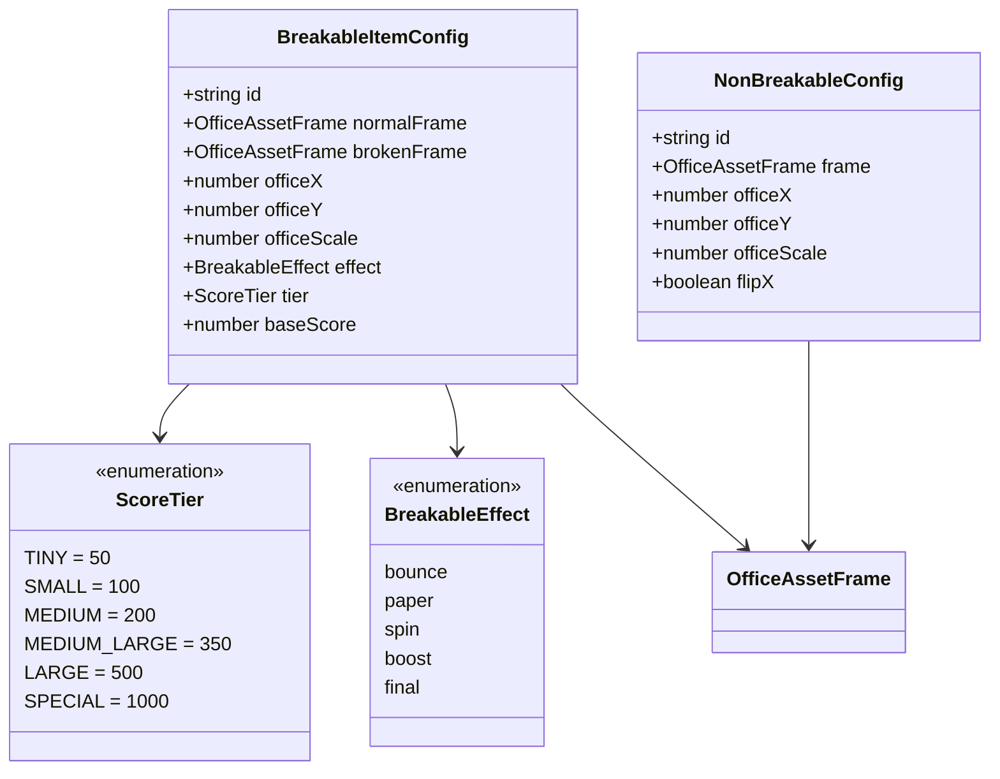
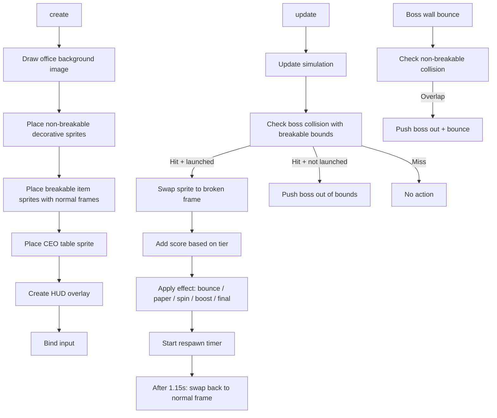

# Boss Fight Office Scene — Architecture Plan

## Goal
Replace the placeholder Graphics-drawn arena in `BossFightScene` with the actual office scene from `WorkdayScene`, using atlas sprites for breakable items that swap to their broken variant on impact, with size-based scoring.

---

## Current State

### BossFightScene (960×600 play area)
- Draws everything with `Phaser.GameObjects.Graphics` — colored rectangles for objects, circles for player/boss
- 8 hardcoded `objectTemplates` with `name, x, y, w, h, color, effect`
- On break: fills a darker rectangle, shows "BROKEN" label
- On respawn: restores original color and label
- Objects respawn after ~1.15s

### WorkdayScene Office (1448×1086 background)
- Renders `office_bakcground.png` + atlas sprites from `OfficeLayoutData.DEFAULT_OFFICE_ITEMS`
- Items placed at office-space coordinates with per-item scale

### Atlas Breakable Pairs (normal → broken)
| Item | Normal Frame | Normal Size | Broken Frame | Broken Size | Tier |
|------|-------------|-------------|-------------|-------------|------|
| Bookcase | `bookcase_normal` | 165×112 | `bookcase_broken` | 193×144 | LARGE |
| Storage Cabinet | `storage_cabinet_normal` | 179×98 | `storage_cabinet_broken` | 187×119 | MEDIUM-LARGE |
| Double Desks | `double_desks_normal` | 185×143 | `double_desks_broken` | 226×152 | LARGE |
| Single Desk | `single_desk_normal` | 132×123 | `single_desk_broken` | 242×134 | MEDIUM-LARGE |
| Copier | `copier_normal` | 87×98 | `copier_broken` | 125×114 | MEDIUM |
| Filing Cabinets | `filing_cabinets_normal` | 176×138 | `filing_cabinets_broken` | 211×134 | LARGE |
| Water Cooler | `water_cooler` | 46×81 | `water_cooler_broken` | 87×116 | SMALL |
| Trash Can | `trash_can` | 38×45 | `trash_can_broken` | 87×62 | TINY |

### CEO Table (separate PNGs, not in atlas)
- `ceo_table_intact.png` → `ceo_table_broken.png` — SPECIAL tier

### Non-breakable Decorative Items
door_mat_01, door_mat_02, tall_potted_plant, large_potted_plant, small_potted_cactus, coffee_station_table, cardboard_stack_large, cardboard_stack_small, low_cabinet_with_plant, file_cabinet_single_01/02/03, blue_storage_unit, paper_shredder

---

## Architecture

### Coordinate Mapping

The office background is 1448×1086. The play area is 960×600. We scale the office to fit:

```
scale = Math.min(960 / 1448, 600 / 1086) ≈ 0.553
displayedWidth  = 1448 × 0.553 ≈ 800
displayedHeight = 1086 × 0.553 ≈ 600
offsetX = (960 - 800) / 2 = 80
offsetY = 0  (height fits perfectly)
```

All office item positions are transformed: `playX = officeX * scale + offsetX`, `playY = officeY * scale + offsetY`

### Data Structures



### BreakableItemConfig — Item Definitions

Derived from `DEFAULT_OFFICE_ITEMS` in `OfficeLayoutData`, filtering only items whose `frame` has a matching `_broken` variant:

| ID | Normal Frame | Broken Frame | Effect | Tier | Score |
|----|-------------|-------------|--------|------|-------|
| bookcase-normal | `bookcase_normal` | `bookcase_broken` | bounce | LARGE | 500 |
| storage-cabinet | `storage_cabinet_normal` | `storage_cabinet_broken` | boost | MEDIUM_LARGE | 350 |
| double-desks-1 | `double_desks_normal` | `double_desks_broken` | bounce | LARGE | 500 |
| double-desks-2 | `double_desks_normal` | `double_desks_broken` | bounce | LARGE | 500 |
| double-desks-3 | `double_desks_normal` | `double_desks_broken` | bounce | LARGE | 500 |
| double-desks-4 | `double_desks_normal` | `double_desks_broken` | bounce | LARGE | 500 |
| single-desk-1 | `single_desk_normal` | `single_desk_broken` | bounce | MEDIUM_LARGE | 350 |
| single-desk-2 | `single_desk_normal` | `single_desk_broken` | bounce | MEDIUM_LARGE | 350 |
| copier | `copier_normal` | `copier_broken` | paper | MEDIUM | 200 |
| filing-cabinets-1 | `filing_cabinets_normal` | `filing_cabinets_broken` | paper | LARGE | 500 |
| filing-cabinets-2 | `filing_cabinets_normal` | `filing_cabinets_broken` | paper | LARGE | 500 |
| water-cooler | `water_cooler` | `water_cooler_broken` | spin | SMALL | 100 |
| trash-can-1 | `trash_can` | `trash_can_broken` | spin | TINY | 50 |
| trash-can-2 | `trash_can` | `trash_can_broken` | spin | TINY | 50 |
| trash-can-3 | `trash_can` | `trash_can_broken` | spin | TINY | 50 |
| trash-can-4 | `trash_can` | `trash_can_broken` | spin | TINY | 50 |
| ceo-table | `ceo_table_intact` | `ceo_table_broken` | final | SPECIAL | 1000 |

> Note: The CEO table uses separate PNGs, not atlas frames. It needs its own texture key loaded in `PreloadScene`.

### Runtime State

Replace the current `BreakableObject` interface:

```typescript
interface BreakableItemState {
  config: BreakableItemConfig;
  sprite: Phaser.GameObjects.Image;  // single sprite, frame swapped on break
  broken: boolean;
  respawnTimer: number;
  // Collision bounds in play-space (computed once from sprite)
  boundsX: number;
  boundsY: number;
  boundsW: number;
  boundsH: number;
}
```

### Rendering Flow



### Collision Bounds Computation

Since sprites use `origin(0.5, 1)` like WorkdayScene props, the display bounds in play-space are:

```typescript
const displayWidth = sprite.width * sprite.scaleX;
const displayHeight = sprite.height * sprite.scaleY;
boundsX = sprite.x - displayWidth / 2;       // origin 0.5
boundsY = sprite.y - displayHeight;          // origin 1.0
boundsW = displayWidth;
boundsH = displayHeight;
```

These are recomputed after frame swap since broken frames are often larger.

---

## File Changes

### 1. New File: `src/game/data/BossFightOfficeData.ts`

Define `BreakableItemConfig`, `NonBreakableConfig`, `ScoreTier`, and the arrays of breakable + non-breakable item configs. Positions derived from `DEFAULT_OFFICE_ITEMS` filtered by frame type.

### 2. Modify: `src/game/scenes/PreloadScene.ts`

Add loading for CEO table images:
```typescript
this.load.image('ceo-table-intact', 'assets/office/ceo_table_intact.png');
this.load.image('ceo-table-broken', 'assets/office/ceo_table_broken.png');
```

### 3. Modify: `src/game/scenes/BossFightScene.ts`

Major refactor — the core changes:

| Area | Before | After |
|------|--------|-------|
| Room background | `Graphics.fillRect` with grid pattern | `this.add.image` with `OfficeAssets.backgroundKey` |
| Breakable objects | `Graphics.fillRoundedRect` colored boxes | Atlas `Image` sprites with frame swap |
| Non-breakable decor | None | Atlas `Image` sprites, boss bounces off |
| Object labels | Text objects centered on rect | Text objects above sprite |
| Collision bounds | Hardcoded `x, y, w, h` | Computed from sprite display bounds |
| Scoring | Flat +460 style per break | Tier-based: 50/100/200/350/500/1000 |
| Payout text | Generic names like DESK SMASH! | Specific: BOOKCASE DEMOLISHED! etc. |
| CEO table | LOGO placeholder | Separate image sprite, SPECIAL tier |
| Break visual | Darker rect + BROKEN label | Frame swap to broken sprite |
| Respawn visual | Restore color + label | Frame swap back to normal sprite |

#### Key method changes:

- **`createDisplay()`** — Add office background image, create sprite groups for breakable and non-breakable items
- **`createObjects()`** — Return `BreakableItemState[]` from `BossFightOfficeData` configs
- **`drawRoom()`** — Remove grid drawing, background is now an Image
- **`drawObjects()`** — Remove Graphics rect drawing; sprites are always visible, just swap frames
- **`breakObject()`** — Call `sprite.setTexture()` or `sprite.setFrame()` to swap; add tier-based score
- **`updateObjects()`** — On respawn, swap frame back to normal
- **`circleRectCollision()`** — Use `boundsX/Y/W/H` from state instead of `object.x/y/w/h`
- **`payoutObjectText()`** — Use item-specific labels from config

### 4. Modify: `src/game/assets/OfficeAssets.ts`

Add CEO table texture keys:
```typescript
ceoTableIntactKey: 'ceo-table-intact',
ceoTableBrokenKey: 'ceo-table-broken',
ceoTableIntactPath: 'assets/office/ceo_table_intact.png',
ceoTableBrokenPath: 'assets/office/ceo_table_broken.png',
```

### 5. Modify: `src/game/config/BalanceConfig.ts`

Update `bossFightDuration` from 20 to match `BalanceConfig.bossFightDuration` (currently 12 in config but 20 in scene — reconcile this).

---

## Size-Based Scoring Tiers

| Tier | Pixel Area Range | Base Score | Items |
|------|-----------------|------------|-------|
| TINY | < 2,000 | 50 | trash_can |
| SMALL | 2,000–5,000 | 100 | water_cooler |
| MEDIUM | 5,000–12,000 | 200 | copier |
| MEDIUM_LARGE | 12,000–20,000 | 350 | single_desk, storage_cabinet |
| LARGE | > 20,000 | 500 | bookcase, double_desks, filing_cabinets |
| SPECIAL | — | 1000 | ceo_table |

The style multiplier and combo system remain unchanged — these base scores feed into the existing `addStyle()` flow.

---

## Non-Breakable Obstacles

Non-breakable items are rendered as atlas sprites but have no broken variant. The boss bounces off them without breaking them. They use the same `circleRectCollision` check but instead of `breakObject()`, they call `pushBossOutOfObject()` (the existing behavior for slow boss impacts).

This means:
- Fast launched boss → hits breakable → breaks it
- Fast launched boss → hits non-breakable → bounces off (wall bounce logic)
- Slow boss → hits anything → pushed out

---

## Implementation Order

1. Create `BossFightOfficeData.ts` with all item configs
2. Add CEO table keys/paths to `OfficeAssets.ts`
3. Add CEO table loading to `PreloadScene.ts`
4. Refactor `BossFightScene.createDisplay()` to use office background
5. Replace `objectTemplates` with data from `BossFightOfficeData`
6. Replace Graphics object rendering with sprite Images
7. Implement frame-swap on break/respawn
8. Add non-breakable decorative obstacles
9. Update collision bounds to use sprite dimensions
10. Implement tier-based scoring
11. Update payout text labels
12. Reconcile game duration with `BalanceConfig`
